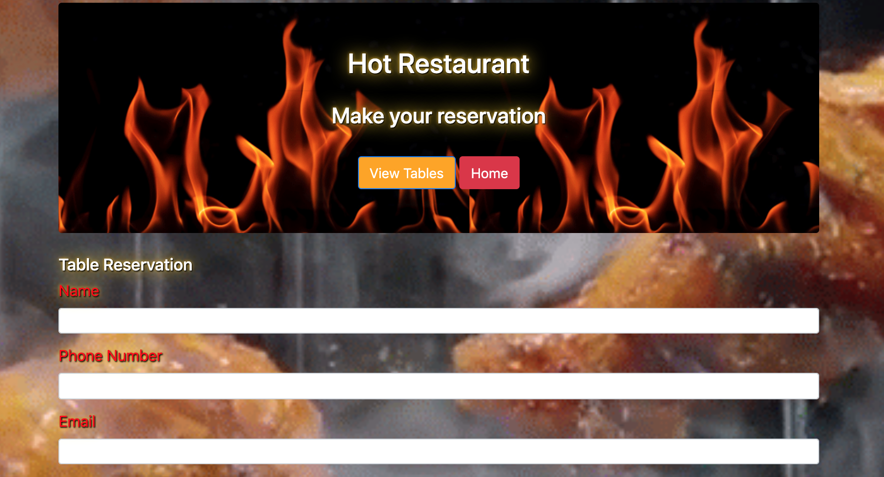

# Hot-Restaurant

## How to Install

* Git Clone the repository
* Navigate to the folder where the repository exists using Git Bash or Terminal
* Run the command npm install to download the required dependencies
* Then run the command node server.js to run the program
---------------------------------------------------------------------------------------
 **Description:** Basic app demonstrating Node and Express with jQuery. Overall purpose is to help schedule reservation requests. Restaurant has just 5 tables available. First five requests get a reservation, every request after that is sent to the waiting list. Uses jQuery to run AJAX calls to GET and POST data from users to the Express server

<!-- * Live Demo: <https://example.bleh> -->

Home Page

Reservation Page

