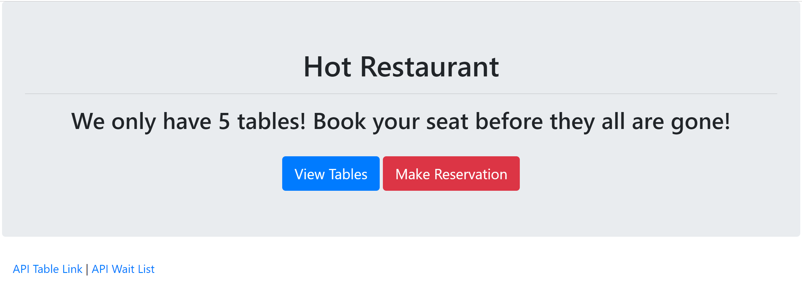

# Hot-Restaurant

* **Description:** Basic app demonstrating Node and Express with jQuery. Overall purpose is to help schedule reservation requests. Restaurant has just 5 tables available. First five requests get a reservation, every request after that is sent to the waiting list. Uses jQuery to run AJAX calls to GET and POST data from users to the Express server

<!-- * Live Demo: <https://example.bleh> -->

Home Page

